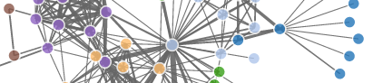

<title>D3network by christophergandrud</title>

<link rel="stylesheet" href="assets/css/styles.css">

<a href="https://github.com/christophergandrud/d3Network"></a>

[Christopher Gandrud](http://christophergandrud.blogspot.com/p/biocontact.html)

<section>

<h1 id="top">d3Network</h1> </img>

### Tools for creating D3 JavaScript force directed network graphs from R.

### v0.4.1


---

<div id="navcontainer">
<ul id="navlist">
<li><a href="#commands">Commands</a></li> 
<li><a href="#standAlone">Output</a></li> 
<li><a href="#install">Install</a></li>
</ul>
</div>

---

[Mike Bostock](http://bost.ocks.org/mike/)'s [D3.js](http://d3js.org/) is great for creating [interactive network graphs](http://bl.ocks.org/mbostock/4062045) with JavaScript.  The [d3Network](https://github.com/christophergandrud/d3Network) package makes it easy to create these network graphs from [R](http://www.r-project.org/). The main idea is that you should able to take an R data frame with information about the relationships between members of a network and create full network graphs with one command.

Currently **d3Network** only supports [force directed](http://en.wikipedia.org/wiki/Force-directed_graph_drawing) network graphs. This basically means that D3 assigns 'forces' to the nodes and edges (links between the nodes) to arrange their placement and simulate movement. 

<h2 id="commands">Commands</h2>

**d3Network** currently has four commands for creating network graphs: 

- <a href="#simple"><code>d3SimpleNetwork</code></a>: simple force directed networks.

- <a href="#forceDirect"><code>d3ForceDirected</code></a>: grouped force directed networks

- <a href="#RTTree"><code>d3Tree</code></a>: Reingold-Tilford trees

- <a href="#ClusterDendro"><code>d3ClusterDendro</code></a>: cluster dendogram

- <a href="#Sankey"><code>d3Sankey</code></a>: Sankey diagram


<br>

<h3 id="simple"><code>d3SimpleNetwork</code></h3>

`d3SimpleNetwork` is designed to take a simple data frame that has two columns specifying the *sources* and *targets* of the nodes in a network and turn it into a graph. You can easily customise the look and feel of the graph. Let's do an example. 

First make some fake data. 

```{r}
Source <- c("A", "A", "A", "A", "B", "B", "C", "C", "D")
Target <- c("B", "C", "D", "J", "E", "F", "G", "H", "I")
NetworkData <- data.frame(Source, Target)
```

It's important to note that the *Source* variable is the first variable and the *Target* is the second. We can use `d3SimpleNetwork`'s `Source` and `Target` arguments to specify which variables are which, if the data is in another order.  

Now we can simply stick the `NetworkData` data frame into `d3SimpleNetwork`:

```{r eval=FALSE}
d3SimpleNetwork(NetworkData, width = 400, height = 250)
```

You'll notice that I added the `width` and `height` arguments. These change the size of the graph area. They are in pixels. Here is the result:

```{r, echo=FALSE, results='asis'}
library(d3Network)
d3SimpleNetwork(NetworkData, width = 400, height = 250,
                iframe = TRUE, file = "img/FirstNetwork.html")
```

Play around with this graph. Notice that when you click on the nodes the text expands and changes colour.

There are many options for customising the look and feel of the graph. For example we can change the colour of the links, nodes, and text. We can also change the opacity of the graph elements:

```{r eval=FALSE, tidy=FALSE}
d3SimpleNetwork(NetworkData, width = 400, height = 250, 
                textColour = "orange", linkColour = "red", 
                nodeColor = "orange", opacity = 0.9)
```

```{r, echo=FALSE, results='asis'}
library(d3Network)
d3SimpleNetwork(NetworkData, width = 400, height = 250,
                iframe = TRUE, file = "img/SecondNetwork.html", 
                textColour = "red", linkColour = "orange", nodeColour = "red",
                opacity = 0.9)
```

There are many different ways you can specify the colours other than just their names (as in this example). One way to select more specific colours is with [hexadecimal colour values](http://en.wikipedia.org/wiki/Web_colors#Shorthand_hexadecimal_form). A nice resource for choosing colour palates is the [Color Brewer](http://colorbrewer2.org/) website. The next example uses hexadecimal colour values.

Other important ways to customise a force directed graph are to change the *link distance* and *charge*. Link distance is simply the distance between the nodes. Charge specifies how strong the force either repelling or pulling together the nodes is. Here is an example with a charge of -50: 

```{r eval=FALSE, tidy=FALSE}
d3SimpleNetwork(NetworkData, width = 400, height = 250, 
                textColour = "#D95F0E", linkColour = "#FEC44F", 
                nodeColour = "#D95F0E", opacity = 0.9,
                charge = -50, fontsize = 12)
```

```{r, echo=FALSE, results='asis'}
library(d3Network)
d3SimpleNetwork(NetworkData, width = 400, height = 250,
                iframe = TRUE, file = "img/ThirdNetwork.html", 
                textColour = "#D95F0E", linkColour = "#FEC44F", 
                nodeColour = "#D95F0E", opacity = 0.9,
                charge = -50, fontsize = 12)
```

This is a weaker charge than what we have seen so far (the default is -200). A weak negative charge means that the nodes do not repel each other as strongly. They are closer together than if there was a larger negative charge. Positive charges make the nodes attracted to one another. Basically, you will get a clump of nodes. Also, in the above example the text was a little small so I increased the *font size* to 12.

Have a look at the `d3SimpleNetwork` documentation for more customisation options.

<br>
<br>

<h3 id="forceDirect"><code>d3ForceDirected</code></h3>

If you want to make more complex force directed graph structures use `d3ForceNetwork`. It allows you to use individual link and node properties to change the distance between individual nodes and the colour of the nodes depending on their membership in specific groups.

Maybe it's better to understand this with an example. We'll use `d3ForceDirected`  to recreate an [example](http://bl.ocks.org/mbostock/4062045) by Mike Bostock. The network graph will show *Les Misérables*' charcters co-occurance (the original data was gathered by [Donald Knuth](http://www-cs-faculty.stanford.edu/~uno/sgb.html)). The link distances are based on how close the characters are to one another and the colours symbolise different character groups.

To start out let's gather the data and create two data frames with it. One of the data frames will have information on the links, similar to what we have worked with so far. The other will have information on individual nodes; in this case *Les Misérables* characters.

```{r, message=FALSE}
# Load RCurl package for downloading the data
library(RCurl)

# Gather raw JSON formatted data
URL <- "https://raw.github.com/christophergandrud/d3Network/master/JSONdata/miserables.json"
MisJson <- getURL(URL, ssl.verifypeer = FALSE)

# Convert JSON arrays into data frames
MisLinks <- JSONtoDF(jsonStr = MisJson, array = "links")
MisNodes <- JSONtoDF(jsonStr = MisJson, array = "nodes")
```

In this example we converted a [JSON](http://en.wikipedia.org/wiki/JSON)-formatted file into two data frames. You can of course just work with R data frames. Now let's look inside these data frames:

```{r}
head(MisLinks)

head(MisNodes)
```

You can see in the `MisLinks` data frame that we again have `source` and `target` columns. Notice that the data frame is sorted by `source`. We also have a new column: `value`. This will be used to determine the link distances.

In the `MisNodes` data frame we have two columns: `name` and `group`. There is one record for each character (node) in the network. They are in the same order as the `source` column in `MisLinks`. The `group` column simply specifies what group each character is in. This will be used to set the nodes' colours.

To make the network graph we just need to tell `d3ForceNetork` where the data frames and columns are:

```{r, eval=FALSE, tidy=FALSE}
d3ForceNetwork(Links = MisLinks, Nodes = MisNodes, 
               Source = "source", Target = "target", 
               Value = "value", NodeID = "name", 
               Group = "group", width = 550, height = 400, 
               opacity = 0.9)
```

```{r, echo=FALSE, results='asis'}
d3ForceNetwork(Links = MisLinks, Nodes = MisNodes, Source = "source",
                Target = "target", Value = "value", NodeID = "name",
                Group = "group", width = 550, height = 400, opacity = 0.9,
               file = "img/Forced.html", iframe = TRUE)
```

Mouse over the nodes to see the characters' names.

#### Zooming

You can also use the `zoom` option to create a graph that you can zoom in and out of with your mouse scroll-wheel:

```{r, eval=FALSE, tidy=FALSE}
d3ForceNetwork(Links = MisLinks, Nodes = MisNodes, 
               Source = "source", Target = "target", 
               Value = "value", NodeID = "name", 
               Group = "group", width = 550, height = 400, 
               opacity = 0.9, zoom = TRUE)
```

```{r, echo=FALSE, results='asis'}
d3ForceNetwork(Links = MisLinks, Nodes = MisNodes, Source = "source",
                Target = "target", Value = "value", NodeID = "name",
                Group = "group", width = 550, height = 400, opacity = 0.9,
               file = "img/ForcedZoom.html", iframe = TRUE, zoom = TRUE)
```

<br>
<br>

<h3 id="RTTree"><code>d3Tree</code></h3>

A clean way to present hierarchical data is with modified [Reingold-Tilford](http://ieeexplore.ieee.org/xpl/login.jsp?tp=&arnumber=1702828&userType=&url=http%3A%2F%2Fieeexplore.ieee.org%2Fstamp%2Fstamp.jsp%3Ftp%3D%26arnumber%3D1702828%26userType%3D) Trees. Use these types of trees when you have a single root connected to hierarchically organized child nodes. 

Use the `d3Tree` command to create the trees. Many of the aesthetic arguments are the same as with the force directed commands above. Zooming is allowed as above. The major difference is that there is only one data argument `List`. This is a list type object that has a particular structure that we'll look at <a href="#TreeDataSt">later</a>. Also, instead of `charge` and `linkDistance` the spacing of `d3Tree` nodes can be set by changing the diameter of the whole graph with the `diameter` argument.

Let's recreate Mike Bostock's [Reingold-Tilford tree example](http://bl.ocks.org/mbostock/4063550), using JSON formatted data. The data shows the [Flare](http://flare.prefuse.org/) class hierarchy.

```{r eval=FALSE, tidy=FALSE}
# Download JSON data
library(RCurl)
URL <- "https://raw.github.com/christophergandrud/d3Network/master/JSONdata/flare.json"
Flare <- getURL(URL)

# Convert to list format
Flare <- rjson::fromJSON(Flare)

# Create Graph
d3Tree(List = Flare, fontsize = 8, diameter = 800)
```

```{r echo=FALSE, results='asis'}
# Download JSON data
library(RCurl)
URL <- "https://raw.github.com/christophergandrud/d3Network/master/JSONdata/flare.json"
Flare <- getURL(URL)

# Convert to list format
Flare <- rjson::fromJSON(Flare)

# Create Graph
d3Tree(List = Flare, fontsize = 8, width = 700, height = 750, diameter = 800,
               file = "img/FlareTree.html", iframe = TRUE)
```

Mouse over the nodes to enlarge the labels.

<h3 id="TreeDataSt">Data structure</h3>

Data for `d3Tree` needs to be in a hierarchical list with one root node and a number of children. All nodes need to be labeled as `name` and all `children` need to be further lists of `name`d nodes. Maybe the best way to understand this is to look at a simple example. The following `CanadaPC` object is a list where the root is Canada. The first level of child nodes are the provinces and territories. These have further children which are capitals/principle cities of each province/territory:

```{r, tidy=FALSE}
CanadaPC <- list(name = "Canada", 
             children = list(list(name = "Newfoundland",
                                  children = list(list(name = "St. John's"))),
                             list(name = "PEI",
                                  children = list(list(name = "Charlottetown"))),
                             list(name = "Nova Scotia",
                                  children = list(list(name = "Halifax"))),
                             list(name = "New Brunswick",
                                  children = list(list(name = "Fredericton"))),
                             list(name = "Quebec",
                                  children = list(list(name = "Montreal"),
                                                  list(name = "Quebec City"))),
                             list(name = "Ontario", 
                                  children = list(list(name = "Toronto"), 
                                                  list(name = "Ottawa"))),
                             list(name = "Manitoba",
                                  children = list(list(name = "Winnipeg"))),
                             list(name = "Saskatchewan",
                                  children = list(list(name = "Regina"))),
                             list(name = "Nunavuet",
                                  children = list(list(name = "Iqaluit"))),
                             list(name = "NWT",
                                  children = list(list(name = "Yellowknife"))),
                             list(name = "Alberta",
                                  children = list(list(name = "Edmonton"))),
                             list(name = "British Columbia",
                                  children = list(list(name = "Victoria"),
                                                  list(name = "Vancouver"))),
                             list(name = "Yukon",
                                  children = list(list(name = "Whitehorse")))
             ))
```

Clearly, R doesn't make it super easy to create these types of lists. As we saw in the previous example, you can always just import correctly formatted JSON files into R and use those instead.

Anyways, let's create a tree graph for the `CanadaPC` data:

```{r eval=FALSE, tidy=FALSE}
d3Tree(List = CanadaPC, fontsize = 10, diameter = 500,
       textColour = "#D95F0E", linkColour = "#FEC44F", 
       nodeColour = "#D95F0E")
```

```{r echo=FALSE, results='asis'}
d3Tree(List = CanadaPC, fontsize = 10, diameter = 500,
       textColour = "#D95F0E", linkColour = "#FEC44F", nodeColour = "#D95F0E",
       width = 550, height = 575,
       file = "img/CanadaTree.html", iframe = TRUE)
```

<br>
<br>

<h3 id="ClusterDendro"><code>d3ClusterDendro</code></h3>

We can use the same <a href="#TreeDataSt">type of data</a> to create cluster dendrograms using the `d3ClusterDendro` command. Again it's aesthetic arguments are similar to the other commands. You can change the width and height of the graph (rather than the graph area) with the `widthCollapse` and `heightCollapse` arguments. These are the proportion of the total graph area `width` and `height` that you would like it to be reduced by. For example, `widthCollapse = 0.5` would reduce the graph by 50% of the overall `width`.

Here is an example using the `CanadaPC` data from above:

```{r eval=FALSE, tidy=FALSE}
d3ClusterDendro(List = CanadaPC, fontsize = 12, 
                zoom = TRUE, widthCollapse = 0.8)
```

```{r echo=FALSE, results='asis'}
d3ClusterDendro(List = CanadaPC, fontsize = 12, zoom = TRUE,
       width = 500, height = 550, widthCollapse = 0.5,
       file = "img/DendroFlare.html", iframe = TRUE)
```

The graph is zoom-able with the scroll-wheel and can be dragged about.

<h3 id="Sankey"><code>d3Sankey</code></h3>

You can use `d3Sankey` to create basic [Sankey diagrams](http://en.wikipedia.org/wiki/Sankey_diagram). Here is an example:

```{r eval=FALSE, tidy=FALSE}
# Load energy projection data
library(RCurl)
URL <- "https://raw.github.com/christophergandrud/d3Network/sankey/JSONdata/energy.json"
Energy <- getURL(URL, ssl.verifypeer = FALSE)
# Convert to data frame
EngLinks <- JSONtoDF(jsonStr = Energy, array = "links")
EngNodes <- JSONtoDF(jsonStr = Energy, array = "nodes")

# Plot
d3Sankey(Links = EngLinks, Nodes = EngNodes, Source = "source",
         Target = "target", Value = "value", NodeID = "name",
         fontsize = 12, nodeWidth = 30, width = 700)
```

```{r echo=FALSE, results='asis'}
# Load energy projection data
library(RCurl)
URL <- "https://raw.github.com/christophergandrud/d3Network/sankey/JSONdata/energy.json"
Energy <- getURL(URL, ssl.verifypeer = FALSE)
# Convert to data frame
EngLinks <- JSONtoDF(jsonStr = Energy, array = "links")
EngNodes <- JSONtoDF(jsonStr = Energy, array = "nodes")

# Plot
d3Sankey(Links = EngLinks, Nodes = EngNodes, Source = "source",
         Target = "target", Value = "value", NodeID = "name",
         fontsize = 12, nodeWidth = 30, width = 700,
         file = "img/Sankey.html", iframe = TRUE)
```

<br>
<br>

<hr>

<h2 id="standAlone">d3Network in stand alone documents</h2>

So far we have only seen the basic syntax for how to create the network graphs. If you've been following along you'll notice that running a **d3Network** command spits out the HTML and JavaScript code needed to create the graph into your R console. If you want to save it to a file creating a stand alone HTML file (i.e. one you can just double click on and it will open in your browser) use the `file` option. For example:

```{r eval=FALSE}
d3SimpleNetwork(NetworkData, file = "ExampleGraph.html")
```

This will create a new file called `ExampleGraph.html` in your working directory.

You can open this file in any text editor and modify the code however you like. See the [D3 Force Layout Wiki](https://github.com/mbostock/d3/wiki/Force-Layout) for more customisation options.

<h2 id="rep">d3Network in dynamic reproducible documents</h2>

If you would like to include network graphs in a [knitr](http://yihui.name/knitr/) [Markdown](http://daringfireball.net/projects/markdown/) dynamically reproducible document just place your **d3Network** code in a code chunk with the option `results='asis'`. Also set the argument `iframe = TRUE` and specify a file name with `file` as before. 

<h2 id="install">Install</h2>

**d3Network** is available for download on [CRAN](http://cran.r-project.org/web/packages/d3Network/). You can also install the latest development build using the [devtools](https://github.com/hadley/devtools) package and the following code:


```{r eval=FALSE}
devtools::install_github("d3Network", "christophergandrud")
```

<br>
<br>
<br>

<div id="disqus_thread"></div>
<script type="text/javascript">
/* * * CONFIGURATION VARIABLES: EDIT BEFORE PASTING INTO YOUR WEBPAGE * * */
var disqus_shortname = 'd3network'; // required: replace example with your forum shortname

/* * * DON'T EDIT BELOW THIS LINE * * */
(function() {
var dsq = document.createElement('script'); dsq.type = 'text/javascript'; dsq.async = true;
dsq.src = '//' + disqus_shortname + '.disqus.com/embed.js';
(document.getElementsByTagName('head')[0] || document.getElementsByTagName('body')[0]).appendChild(dsq);
})();
</script>
<noscript>Please enable JavaScript to view the <a href="http://disqus.com/?ref_noscript">comments powered by Disqus.</a></noscript>
<a href="http://disqus.com" class="dsq-brlink">comments powered by <span class="logo-disqus">Disqus</span></a>
    

</section>

---

<footer>

<div style="float:right"><a href="#top">Back to Top</a></div>

[Christopher Gandrud](http://christophergandrud.blogspot.com/p/biocontact.html)

<a href="https://twitter.com/ChrisGandrud"></a> <a href="https://github.com/christophergandrud"></a>

</footer>

<script type="text/javascript">

var _gaq = _gaq || [];
_gaq.push(['_setAccount', 'UA-41657792-1']);
_gaq.push(['_trackPageview']);

(function() {
var ga = document.createElement('script'); ga.type = 'text/javascript'; ga.async = true;
ga.src = ('https:' == document.location.protocol ? 'https://ssl' : 'http://www') + '.google-analytics.com/ga.js';
var s = document.getElementsByTagName('script')[0]; s.parentNode.insertBefore(ga, s);
})();

</script>

